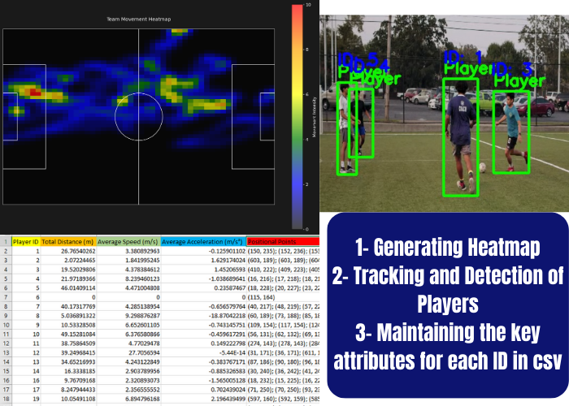

  
*Above image shows the key attributes/features of this project.*
# Football Player Tracking System

This project implements a **Football Player Tracking System** using state-of-the-art computer vision techniques. The system leverages the **YOLO11 model** for detecting players in video frames and tracks their movements over time.

## Key Features
- **Player Detection and Tracking:** Detects and tracks football players across video frames with bounding boxes around them.
- **Distance and Speed Calculation:** Calculates player movement metrics, including distance traveled and speed.
- **Heatmap Generation:** Generates heatmaps based on player movements for both individual players and the entire team.
- **Real-Time Video Processing:** Processes football game footage in real time, tracking player movement and providing valuable insights.

## Key Concepts and Parameters

### 1. YOLO11 Model for Player Detection
- **YOLO (You Only Look Once)** is used to detect players in each frame of the video. The model is pre-trained and can efficiently detect players in real time.

### 2. Distance and Speed Calculation
- **Pixel to Meter Conversion:** A calibration process is used to convert pixels to real-world meters, allowing for the calculation of real-world distances and speeds.
  
  **Steps to Adjust `pixel_to_meter`:**
  - Identify a reference object in the video with a known real-world size (e.g., a soccer field line or player height).
  - Measure the object's pixel size in the video frame.
  - Calculate the conversion factor using the formula:  
    `pixel_to_meter = Real-World Size (m) / Pixel Size (px)`

### 3. Tuning Tracker Parameters
- **max_age:** Controls how long an object is kept in memory before it is discarded. Higher values allow for longer tracking during occlusions or missed detections.
- **min_hits:** Defines the minimum number of consecutive frames an object must be detected to be tracked. A higher value reduces false positives.
- **iou_threshold:** Sets the threshold for matching detected objects to existing tracks. A higher value ensures strict matching, while a lower value works better in crowded scenes.

### Example Use Case:
For tracking players in a football game:
- **max_age=25:** Ensures that players are tracked even if they temporarily overlap or move behind others.
- **min_hits=3:** Tracks only consistently detected players, minimizing false positives.
- **iou_threshold=0.3:** Ensures proper tracking even if bounding boxes slightly overlap.

## Conclusion

This system allows for efficient tracking of football players during a game, providing insights into player movement and performance. The modularity of the system makes it adaptable to different types of video analysis projects.

